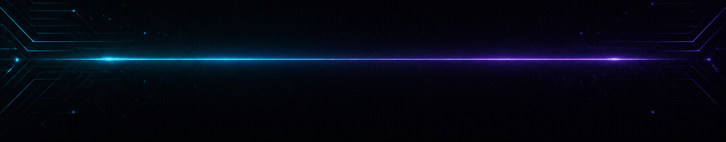

<!-- ponytail: honest AI/testing strengths, no fake tenure or empty metrics -->
<!-- achievement-pass: 2 -->
<div align="center">


[](https://git.io/typing-svg)


**Full-stack developer · Malaysia · AI-assisted delivery**

[](https://github.com/KhyFee)
[](mailto:khaixd756@gmail.com)
[](mailto:khaixd756@gmail.com)


</div>

## About

I use AI to move fast without cutting corners: scope quickly, ship working software, then pressure-test it until the bugs surface.

- 🤖 **Experienced with AI** for planning, coding, and tight iteration loops
- ⚡ **Fast projects / fast finish** — prototype → polish → done
- 🐞 **Strong bug & problem detection** — find the break, fix the cause
- 🎭 **Playwright** for end-to-end coverage that catches real user failures
- 💨 **Smoke tests** for quick confidence before and after deploys
- 📍 Based in **Malaysia**

---

## Skills Dashboard

<!-- ponytail: shields badges — GitHub proxies away animated SVG and renders block chars as tofu -->

<div align="center">


</div>

---

## AI & Delivery

| Mode | What I do |
|------|-----------|
| **AI workflows** | Break problems down, generate options, implement the shortest path that works |
| **Rapid delivery** | Cut scope that doesn't matter, ship the path that does |
| **Finish quality** | Leave runnable checks behind so the next change doesn't break the last one |

```bash
# how I work
plan → build with AI → verify → smoke → ship
```

---

## Testing & Debugging

| Tool / habit | Why it matters |
|--------------|----------------|
| **Playwright** | Catch UI and flow regressions before users do |
| **Smoke tests** | Fast pass/fail signal after every meaningful change |
| **Root-cause debugging** | Trace the shared failure path instead of patching symptoms |

```text
failing flow → reproduce → isolate → fix once → re-run smoke + e2e
```

---

## Stack

**Frontend**  


**Backend & Data**  


**AI · QA · Tools**  


---

## Featured Projects

| Repo | What it does |
|------|----------------|
| **[LensQA](https://github.com/KhyFee/LensQA)** | Frontend quality cloud — visual, a11y, perf, and runtime QA |
| **[Deflake](https://github.com/KhyFee/Deflake)** | Flaky test auto-triager — parallel Playwright + evidence-based fixes |
| **[DocuSource](https://github.com/KhyFee/DocuSource)** | Enterprise knowledge RAG with direct citations |
| **[MarginWatch](https://github.com/KhyFee/MarginWatch)** | B2B supplier portal automator — session reuse, price deltas, alerts |
| **[A11yGuard](https://github.com/KhyFee/A11yGuard)** | Automated PR accessibility reviewer — WCAG + SARIF |
| **[SafeMigrate](https://github.com/KhyFee/SafeMigrate)** | Zero-downtime migration sandbox — shadow clone, schema diff, rollback |

**Discussions (feedback welcome):**  
[LensQA](https://github.com/KhyFee/LensQA/discussions/5) · [Deflake](https://github.com/KhyFee/Deflake/discussions/5) · [DocuSource](https://github.com/KhyFee/DocuSource/discussions/5) · [MarginWatch](https://github.com/KhyFee/MarginWatch/discussions/4) · [A11yGuard](https://github.com/KhyFee/A11yGuard/discussions/4) · [SafeMigrate](https://github.com/KhyFee/SafeMigrate/discussions/4)

---

## Open Source

Playwright CI/e2e, accessibility fixes, and review feedback across public repos — plus contextual replies in [GitHub Community Discussions](https://github.com/orgs/community/discussions).

[](https://github.com/KhyFee/daily-ship-log) [](https://github.com/KhyFee/daily-ship-log/blob/main/LICENSE)

**[daily-ship-log](https://github.com/KhyFee/daily-ship-log)** — scheduled daily Playwright / a11y / delivery tip (one real commit per MYT day; not empty commits). [Welcome discussion →](https://github.com/KhyFee/daily-ship-log/discussions/1)

### Pull requests

| PR | Focus |
|----|--------|
| [clawboo#109](https://github.com/clawboo/clawboo/pull/109) | Run Playwright e2e suite in CI |
| [MiniSearch#2293](https://github.com/felladrin/MiniSearch/pull/2293) | Playwright smoke on production Docker check |
| [philaconvalley/website#116](https://github.com/philaconvalley/website/pull/116) | WCAG contrast on pink CTAs |
| [bearr-lab/rama#19](https://github.com/bearr-lab/rama/pull/19) | Navbar / theme toggler a11y |
| [anuj98/portfoliov2#7](https://github.com/anuj98/portfoliov2/pull/7) | Contrast, heading order, document title |
| [soroban-testbench#19](https://github.com/SorobanGuard-Labs/soroban-testbench/pull/19) | Focus + live regions |
| [leaklens#5](https://github.com/andrewcb22/leaklens/pull/5) | Playwright browser audit + HTML fallback |
| [material-event-radar#27](https://github.com/huluwa2026/material-event-radar/pull/27) | axe Playwright + contrast |
| [built-by-ann#15](https://github.com/built-by-ann/built-by-ann.github.io/pull/15) | ESLint `jsx-a11y` |
| [quay#6704](https://github.com/quay/quay/pull/6704) | Playwright fixtures reference in AGENTS.md |
| [go-eazy#1095](https://github.com/enginow-in/go-eazy/pull/1095) | Footer keyboard a11y |

### Reviews & community

Substantive PR reviews on Playwright / e2e / a11y changes (e.g. sightmap, test-warden, pest-plugin-browser, disable-blog, reuben-photography, and others), plus troubleshooting replies on Actions schedules, achievements, and Copilot in Community Discussions.

---

## Achievements

<div align="center">

[](https://github.com/KhyFee?tab=achievements)
[](https://github.com/KhyFee?tab=achievements)
[](https://github.com/KhyFee?tab=achievements)

[View all on profile →](https://github.com/KhyFee?tab=achievements)

</div>

---

## GitHub Activity

<!-- ponytail: official github-readme-stats.vercel.app is 503 paused; community mirror -->

<div align="center">
  
  <br/>
  
  
</div>

---

## Connect

<div align="center">

📬 [khaixd756@gmail.com](mailto:khaixd756@gmail.com) · 💻 [github.com/KhyFee](https://github.com/KhyFee)

<br/>




</div>
